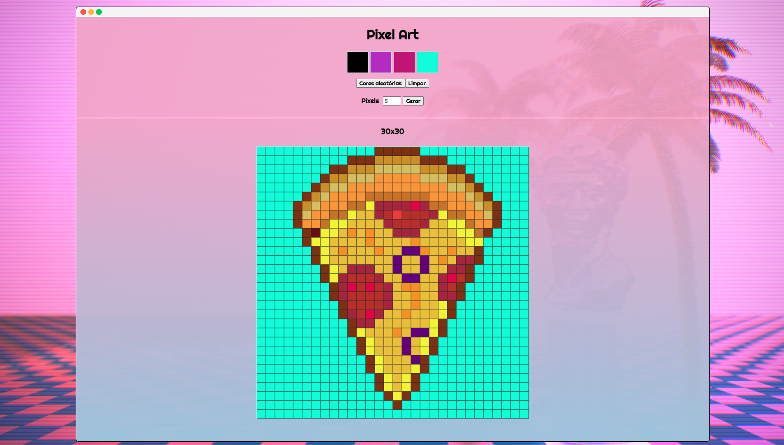

# Pixel Art

Projeto de pixels art desenvolvido durante o curso da Trybe

Esse foi o terceiro projeto desenvolvido no curso da Trybe, dessa vez, colocamos em pratica todas as linguagens basicas de desenvolvimento web funcionando juntas, o **HTML, CSS e Javascript**. O desafio foi um site para criar desenhos em pixel art, de primeira aparenta a ser um sistema simples, mas por tras, carrega um grande desafio de desenvolvimento. O projeto foi concluido em 2 dias, mas como eu gostei da proposta, estou melhorando a interface aos poucos ao decorrer dos dias.

## Tecnologias utilizadas

Dessa vez utilizamos a base do desenvolvimento web

- HTML
- CSS
- Javascript

## Requisitos do projeto

Os projetos Trybe, possuem um contexto com o aprendizado e o mercado e para avaliação, é requisitado algumas especificações para teste de conhecimento. Os requisitos são: 

1. Adicione à página o título "Paleta de Cores".

2. Adicione à página uma paleta contendo quatro cores distintas.

3. Adicione a cor preta como a primeira cor da paleta de cores.

4. Adicione um botão para gerar cores aleatórias para a paleta de cores.

5. Implemente uma função usando localStorage para que a paleta de cores gerada 
aleatoriamente seja mantida após recarregar a página.

6. Adicione à página um quadro contendo 25 pixels.

7. Faça com que cada pixel do quadro tenha largura e altura de 40 pixels e borda 
preta de 1 pixel de espessura.

8. Defina a cor preta como cor inicial da paleta de cores

9. Crie uma função para selecionar uma cor na paleta de cores e preencha os pixels no quadro.

10. Crie uma função que permita preencher um pixel do quadro com a cor selecionada na paleta de cores.

11. Crie um botão que retorne a cor do quadro para a cor inicial.

12. Crie uma função para salvar e recuperar o seu desenho atual no localStorage
Requisitos Bônus

13. Crie um input que permita à pessoa usuária preencher um novo tamanho para o quadro de pixels.

14. Crie uma função que limite o tamanho mínimo e máximo do quadro de pixels.

15. Crie uma função para manter o tamanho novo do board ao recarregar a página.

## Como ficou a interface

Como citado anteriormente, estou melhorando a interface ao decorrer dos dias. Desenvolvendo o projeto, senti que uma interface no estilo [Vaporwave](https://pt.wikipedia.org/wiki/Vaporwave) casava bastante com o tema do projeto. Me inspirando em alguns materias, a interface ficou dessa forma: 

Caso queria fazer a sua pixel art, entra la na [pagina!](https://merkulino.github.io/Pixels_Art-Projeto_Trybe_3/) 

## Material utilizado de fora 

A foto de plano de fundo utilizada no projeto foi produzida por: [Rafael-De-Jongh](https://www.deviantart.com/rafael-de-jongh/art/Vaporwave-Aesthetic-676647412)

# Autor

**Melqui Brito de Jesus**

Não utilizo redes sociais (além do linkedin), mas caso queiram entrar em contato:

Linkedin: https://www.linkedin.com/in/melqui-brito-871676188/

Telegram: https://t.me/Merkulino

Email: Merkulino11@gmail.com

:shipit: 
